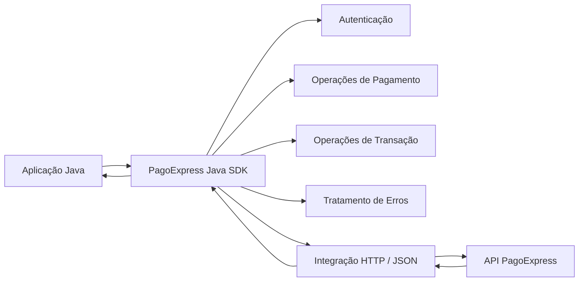
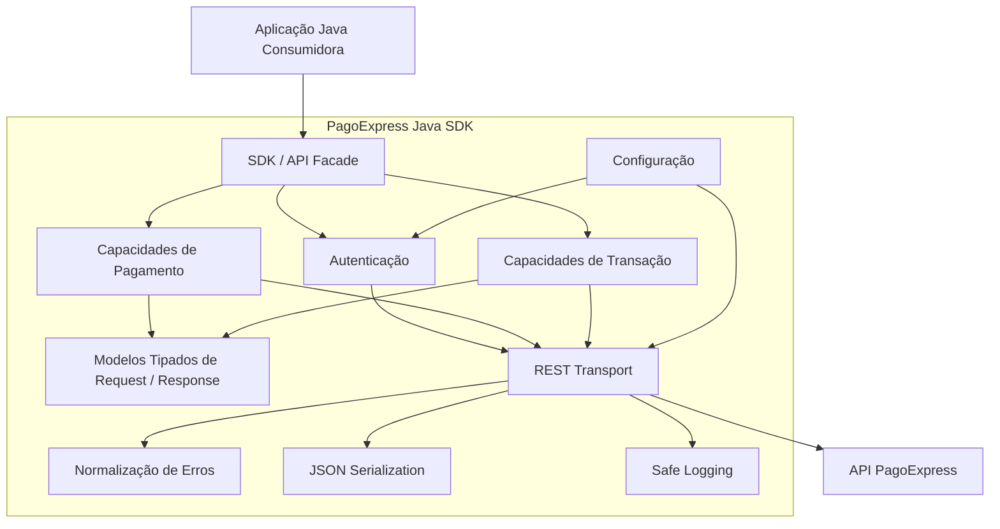
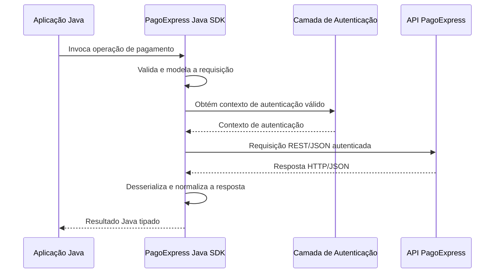
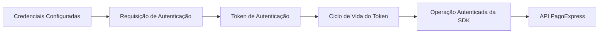
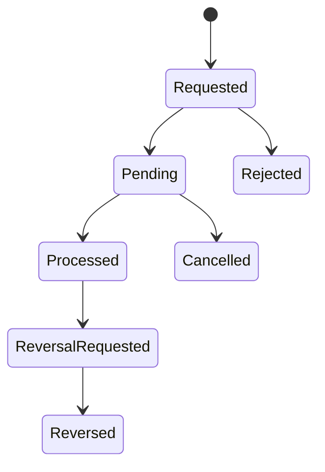
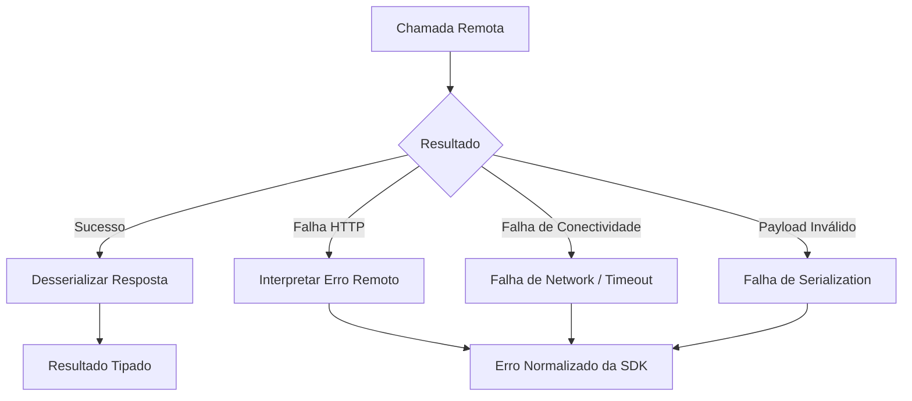

# PagoExpress Java SDK

> **Documentação pública de engenharia de um projeto de software comercial e funcional.**  
> O código-fonte proprietário não está incluído porque pertence ao cliente.


[🇺🇸 English version](./README.md)

---

## Sobre este repositório

Este repositório documenta o trabalho de engenharia por trás de uma **SDK Java funcional desenvolvida como uma entrega comercial para a PagoExpress**.

A SDK foi criada para fornecer às aplicações Java uma camada estruturada de integração com as capacidades de pagamento da PagoExpress, reduzindo a necessidade de os sistemas consumidores implementarem manualmente autenticação, comunicação HTTP, serialização JSON, tratamento de requisições de pagamento, interpretação de erros da API e integração com o ciclo de vida dos pagamentos.

O código-fonte original não é publicado intencionalmente.

Este **não é um projeto tutorial, exercício acadêmico, proof of concept, clone ou arquitetura fictícia**. Ele documenta um projeto real para cliente que foi projetado, implementado, testado e entregue como parte de um trabalho comercial de desenvolvimento de software.

A documentação foi escrita de forma independente para fins de portfólio e apresentação profissional e foi sanitizada para evitar a exposição de propriedade intelectual pertencente ao cliente, credenciais, especificações privadas da API, dados de produção, infraestrutura interna ou código-fonte proprietário.

---

## Classificação do projeto

| Item | Informação |
|---|---|
| Tipo de projeto | Projeto comercial de software |
| Entregável | Java SDK |
| Domínio | Integração de pagamentos / fintech |
| Cliente | PagoExpress |
| Linguagem principal | Java 17 |
| Build | Maven |
| Estilo de integração | REST / JSON |
| Responsabilidade principal | Abstração das capacidades da API PagoExpress para aplicações Java |
| Código-fonte | Proprietário — não divulgado publicamente |
| Objetivo do repositório | Documentação pública de engenharia |
| Status | Entregue |
| Relação com os plugins de e-commerce | Entregável separado |

---

## O problema

A integração direta com uma API de pagamentos introduz responsabilidades que rapidamente se espalham pela aplicação consumidora:

- autenticação;
- gerenciamento de credenciais;
- construção de requisições HTTP;
- serialização e desserialização;
- modelos de requisição e resposta;
- operações específicas de pagamento;
- interpretação do estado de transações;
- erros da API;
- falhas de rede;
- notificações assíncronas;
- idempotência;
- registro de informações sensíveis em logs;
- configuração de ambiente;
- compatibilidade com a API remota.

Repetir essas responsabilidades em cada sistema Java que necessitasse da PagoExpress aumentaria duplicação, acoplamento, inconsistência e custo de manutenção.

A SDK foi criada para centralizar essas preocupações por trás de abstrações orientadas ao Java.

---

## A solução entregue

O projeto entregou uma camada reutilizável de integração Java responsável por encapsular a comunicação com a PagoExpress e expor operações de pagamento por meio de interfaces estruturadas no nível da aplicação.

Em alto nível:



A SDK concentrou responsabilidades de infraestrutura e integração remota para que as aplicações consumidoras não precisassem reproduzir o contrato de baixo nível da API em cada operação.

---

## Principais capacidades

O projeto original contemplou capacidades de pagamento e integração incluindo:

- autenticação;
- gerenciamento do ciclo de vida de token;
- operações PIX;
- operações boleto;
- operações de pagamento com cartão disponíveis na entrega original da SDK;
- consultas de transação;
- operações relacionadas a captura;
- cancelamento;
- operações relacionadas a reversão/estorno;
- tratamento de status de pagamento;
- suporte de integração relacionado a webhooks;
- serialização de requisições/respostas;
- normalização de erros da API;
- preocupações de integração relacionadas à idempotência;
- safe logging e mascaramento de dados sensíveis;
- validação em sandbox.

> **Nota de escopo:** a evolução posterior de Card V2 desenvolvida para as integrações de e-commerce é uma evolução separada do projeto e não é apresentada aqui como parte do contrato original da SDK.

Consulte [Escopo Funcional](docs/03-functional-scope.md) e [Capacidades da API](docs/05-api-capabilities.md).

---

## Minhas responsabilidades

Meu trabalho de engenharia incluiu o projeto e a implementação do artefato de integração Java, incluindo:

- estruturação da SDK como um entregável separado;
- mapeamento das capacidades remotas de pagamento para abstrações Java;
- modelagem dos dados de requisição e resposta;
- implementação da comunicação REST/JSON;
- implementação das responsabilidades de autenticação;
- tratamento de operações autenticadas baseadas em token;
- organização das responsabilidades específicas de pagamento;
- tratamento de falhas da API e de conectividade;
- mapeamento das respostas remotas para estruturas Java adequadas ao consumidor;
- suporte às preocupações de integração de pagamentos síncronas e assíncronas;
- aplicação de práticas de safe logging;
- validação da integração contra o sandbox da PagoExpress;
- empacotamento do projeto com Maven;
- preparação da SDK para consumo independente dos plugins de e-commerce.

A SDK e os plugins de e-commerce da PagoExpress são documentados intencionalmente como entregáveis de software separados.

Consulte [Minha Contribuição de Engenharia](docs/02-my-contribution.md).

---

## Technology stack

| Área | Tecnologia / abordagem |
|---|---|
| Linguagem | Java 17 |
| Framework / ecosystem | Spring Boot |
| Build e dependency management | Maven |
| Comunicação | REST over HTTP |
| Payload format | JSON |
| HTTP integration | RestTemplate |
| JSON mapping | Jackson / ObjectMapper |
| Authentication | Basic Auth durante o fluxo de autenticação + uso de token autenticado |
| Modeling | Java DTOs tipados / modelos de request-response |
| Validation | Sandbox integration testing |
| Automation / delivery support | GitHub Actions / Docker usados no ecossistema de entrega |

Somente tecnologias atribuíveis a esta entrega da SDK são apresentadas aqui. Tecnologias de Magento, WooCommerce, PrestaShop, Shopify ou implementações posteriores de backend não são atribuídas à SDK apenas porque foram utilizadas em outros pontos do ecossistema PagoExpress.

Consulte [Technology Stack](docs/15-technology-stack.md).

---

## Arquitetura

A documentação pública de arquitetura descreve intencionalmente limites e responsabilidades em vez de reproduzir packages proprietários, nomes de classes, paths privados de endpoints ou código-fonte da implementação.



Leia a documentação completa de arquitetura:

- [Visão Geral da Arquitetura](docs/04-architecture.md)
- [Authentication](docs/06-authentication.md)
- [Fluxos de Pagamento](docs/07-payment-flows.md)
- [Error Handling](docs/08-error-handling.md)
- [Security Engineering](docs/09-security.md)

---

## Ciclo de vida de uma requisição

Uma operação típica da SDK segue este ciclo conceitual:



Este diagrama é conceitual e evita intencionalmente nomes de classes pertencentes ao cliente e detalhes de endpoints privados.

---

## Ciclo de vida da autenticação

A autenticação é tratada como uma responsabilidade de integração em vez de ser repetida por cada aplicação consumidora.



O repositório deliberadamente não divulga credenciais reais, headers privados, tokens, valores de expiração ou configuração de produção.

Consulte [Authentication](docs/06-authentication.md).

---

## Ciclo de vida do pagamento

APIs de pagamento combinam comportamento síncrono de request/response com mudanças assíncronas de estado.



O modelo exato de estados acima é uma representação conceitual pública. Identificadores internos e mapeamentos privados de status da API são intencionalmente omitidos.

---

## Error handling

Uma SDK reutilizável não pode expor apenas o comportamento bruto de HTTP.



O objetivo de engenharia é fornecer aos consumidores um modelo de falha orientado à integração sem vazar material de autenticação ou dados sensíveis brutos.

Consulte [Error Handling](docs/08-error-handling.md).

---

## Princípios de segurança

Como o projeto opera no domínio de pagamentos, a documentação pública destaca as responsabilidades de segurança consideradas durante a integração:

- credenciais não devem ser hard-coded;
- tokens não devem ser commitados no source control;
- headers de autenticação nunca devem ser expostos em logs públicos;
- informações de pagamento devem ser tratadas como sensíveis;
- erros remotos devem ser sanitizados antes do logging;
- configurações de sandbox e produção devem permanecer separadas;
- dados reais de clientes não devem ser usados em exemplos públicos;
- a documentação pública não deve divulgar contratos privados da API;
- o tratamento de webhooks não deve confiar em dados recebidos arbitrariamente;
- operações assíncronas exigem tratamento seguro de estado;
- idempotência deve ser considerada em operações relacionadas a pagamento.

Consulte [Security Engineering](docs/09-security.md) e [SECURITY.md](SECURITY.md).

---

## Estratégia de testes e qualidade

A SDK foi validada como um artefato de integração, e não tratada apenas como uma coleção de chamadas HTTP.

A estratégia de qualidade documentada cobre:

- validação isolada de comportamento;
- serialização e desserialização;
- cenários de autenticação;
- fluxos de pagamento bem-sucedidos;
- cenários de requisição inválida;
- falhas da API remota;
- falhas de conectividade;
- consultas de transação;
- tratamento do estado de pagamentos;
- cenários de cancelamento/reversão;
- comportamento de notificações assíncronas;
- validação de integração em sandbox.

Nenhum percentual de coverage, quantidade de testes, benchmark ou número de performance inventado é apresentado neste repositório.

Consulte [Testing and Quality](docs/10-testing-quality.md).

---

## Decisões de engenharia

O repositório contém Architecture Decision Records (ADRs) para explicar decisões importantes de engenharia sem expor código-fonte da implementação.

Registros atuais:

1. [SDK como Entregável Independente](adr/0001-sdk-as-independent-deliverable.md)
2. [Modelos Tipados na Fronteira da API](adr/0002-typed-models-at-api-boundary.md)
3. [Comunicação Remota Centralizada](adr/0003-centralized-remote-communication.md)
4. [Responsabilidade de Autenticação Centralizada](adr/0004-centralized-authentication.md)
5. [Erros de Integração Normalizados](adr/0005-normalized-integration-errors.md)
6. [Responsabilidades Síncronas e Assíncronas de Pagamento](adr/0006-sync-and-async-payment-concerns.md)
7. [SDK e Plugins de E-commerce Permanecem Separados](adr/0007-sdk-plugin-separation.md)

---

## Principais desafios de engenharia

O projeto envolveu preocupações comuns a integrações reais de pagamento, e não apenas desenvolvimento CRUD:

### Abstração da API externa

A SDK precisava proteger os consumidores de detalhes de baixo nível de HTTP e JSON sem esconder comportamentos relevantes de pagamento.

### Ciclo de vida da autenticação

A autenticação precisava ser tratada centralmente para que as aplicações consumidoras não reproduzissem repetidamente o gerenciamento de credenciais e token.

### Modelagem tipada de dados

Payloads remotos precisavam ser representados por estruturas Java mais seguras para consumo e manutenção do que maps não estruturados.

### Estado do pagamento

Requisições de pagamento podem não ser concluídas na mesma interação HTTP em que foram criadas. A integração, portanto, precisava considerar tanto respostas imediatas quanto atualizações posteriores de estado.

### Normalização de erros

Falhas de HTTP, autenticação, serialization, regras de negócio e network possuem significados diferentes e precisam ser compreensíveis aos consumidores da SDK.

### Informações sensíveis

Logs e diagnósticos são essenciais em projetos de integração, mas credenciais e informações financeiras não podem ser expostas acidentalmente.

### Múltiplas capacidades de pagamento

PIX, boleto, operações relacionadas a cartão, consultas de transação, cancelamento, captura e reversão introduzem diferentes semânticas de request e ciclo de vida por trás de uma fronteira consistente de integração Java.

Consulte [Desafios e Soluções](docs/12-challenges-solutions.md).

---

## Limites do projeto

A PagoExpress Java SDK foi um **entregável separado**.

Ela não deve ser confundida com:

- plugin Magento 2;
- plugin WooCommerce;
- plugin PrestaShop;
- integração Shopify;
- clientes HTTP posteriores implementados dentro de outros componentes PagoExpress;
- a evolução posterior do projeto Card V2.

Esses projetos podem integrar com a mesma plataforma PagoExpress, mas possuem arquitetura, runtime, restrições e decisões de implementação próprias.

---

## Mapa do repositório

```text
.
├── README.md
├── README-PT-BR.md
├── NOTICE.md
├── PUBLIC_DISCLOSURE.md
├── SECURITY.md
├── PROJECT_METADATA.md
├── docs/
├── adr/
├── diagrams/
├── examples/
└── evidence/
```

A navegação detalhada do repositório está disponível no [Índice da Documentação](docs/README.md).

---

## O que está incluído

Este repositório contém:

- documentação técnica escrita de forma independente;
- explicações de arquitetura;
- diagramas Mermaid conceituais;
- descrições de responsabilidades de engenharia;
- descrições de capacidades funcionais;
- justificativas de design;
- ADRs;
- considerações de segurança;
- estratégia de testes;
- análise de desafios/soluções;
- exemplos sintéticos e pseudocode;
- metadados sanitizados do projeto;
- regras de divulgação pública.

---

## O que não está incluído

Este repositório **não** contém:

- código-fonte pertencente ao cliente;
- histórico privado do Git;
- conteúdo do repositório privado;
- estruturas proprietárias exatas de packages;
- implementações proprietárias de classes;
- documentos privados Swagger/OpenAPI;
- paths de endpoints não publicados;
- credenciais de produção;
- tokens ou API keys;
- URLs de produção;
- endereços IP internos;
- dados de clientes;
- dados reais de transações;
- database dumps;
- screenshots confidenciais;
- contratos do cliente;
- valores comerciais;
- conversas internas;
- detalhes confidenciais de infraestrutura.

Consulte [Política de Divulgação Pública](PUBLIC_DISCLOSURE.md).

---

## Exemplos sintéticos

Os exemplos em [`examples/`](examples/) são **materiais ilustrativos criados especificamente para este repositório público**.

Eles não são copiados nem derivados linha por linha da implementação proprietária e não devem ser interpretados como o código-fonte original.

---

## Aviso de propriedade intelectual

Os nomes PagoExpress, trademarks, especificações privadas da API, sistemas de produção e a implementação proprietária permanecem propriedade de seus respectivos detentores de direitos.

O código-fonte da SDK comercial não é licenciado nem distribuído por meio deste repositório.

Os textos e diagramas deste repositório foram criados de forma independente para fins de documentação profissional e apresentação de portfólio.

Consulte [NOTICE.md](NOTICE.md).

---

## Sobre o engenheiro

**Abinadabe Oliveira**  
Software Developer — Java, Spring, Angular, Python, APIs, integrações e cloud.

Este repositório faz parte de um portfólio profissional de engenharia que documenta entregas reais de software cujo código-fonte proprietário não pode ser divulgado publicamente.
