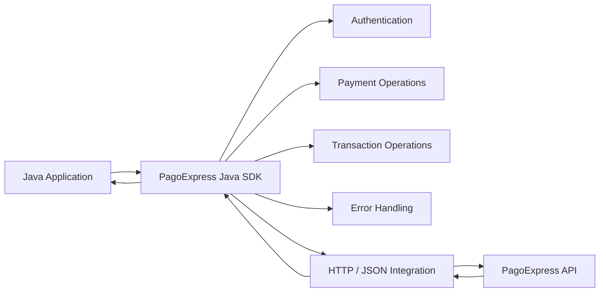
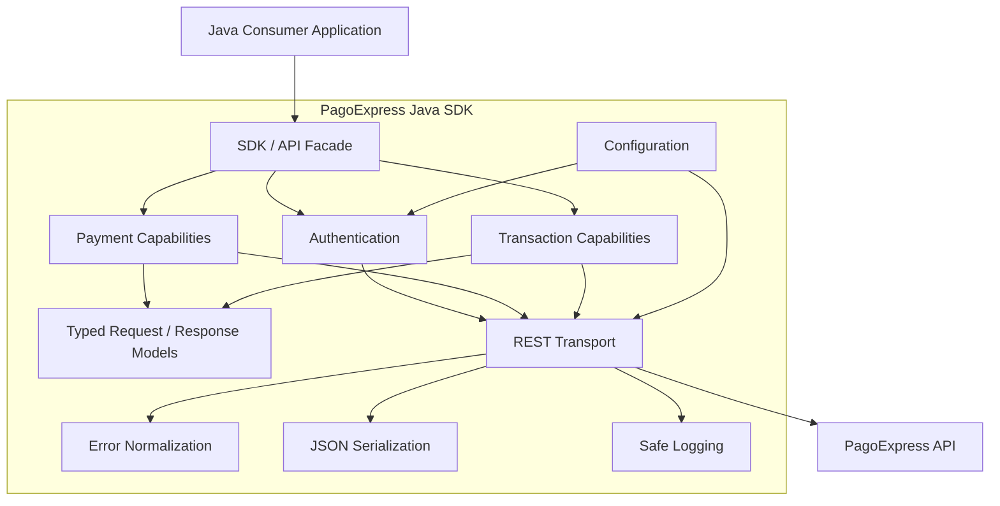
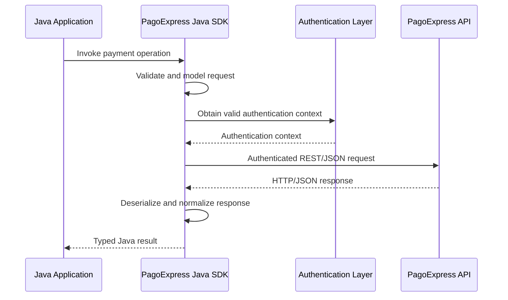
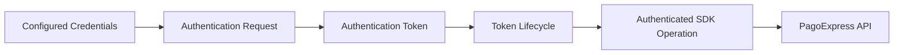
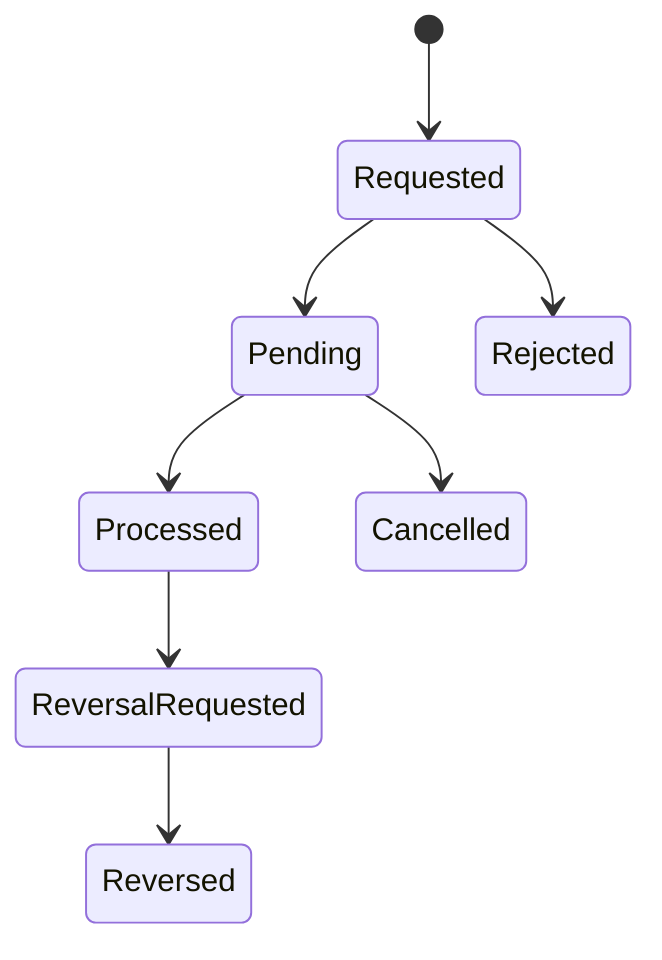
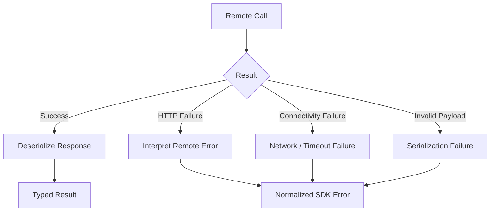

# PagoExpress Java SDK

> **Public engineering documentation for a functional commercial software project.**  
> The proprietary source code is not included because it belongs to the client.


[Versão em Português](./README-PT-BR.md)

---

## About this repository

This repository documents the engineering work behind a **functional Java SDK developed as a commercial delivery for PagoExpress**.

The SDK was created to provide Java applications with a structured integration layer for PagoExpress payment capabilities, reducing the need for consumers to manually implement authentication, HTTP communication, JSON serialization, payment request handling, API error interpretation, and payment lifecycle integration.

The original source code is intentionally not published.

This is **not a tutorial project, academic exercise, proof of concept, clone, or fictional architecture**. It documents a real client project that was designed, implemented, tested, and delivered as part of a commercial software engagement.

The documentation was written independently for portfolio and professional presentation purposes and was sanitized to avoid exposing client-owned intellectual property, credentials, private API specifications, production data, internal infrastructure, or proprietary source code.

---

## Project classification

| Item | Information |
|---|---|
| Project type | Commercial software project |
| Deliverable | Java SDK |
| Domain | Payment integration / fintech |
| Client | PagoExpress |
| Primary language | Java 17 |
| Build | Maven |
| Integration style | REST / JSON |
| Main responsibility | Abstraction of PagoExpress API capabilities for Java consumers |
| Source code | Proprietary — not publicly disclosed |
| Repository purpose | Public engineering documentation |
| Status | Delivered |
| Relationship to e-commerce plugins | Separate deliverable |

---

## The problem

Direct integration with a payment API introduces concerns that quickly spread through a consuming application:

- authentication;
- credential handling;
- HTTP request construction;
- serialization and deserialization;
- request and response models;
- payment-specific operations;
- transaction state interpretation;
- API errors;
- network failures;
- asynchronous notifications;
- idempotency;
- logging of sensitive information;
- environment configuration;
- compatibility with the remote API.

Repeating those responsibilities across every Java system that needs PagoExpress would increase duplication, coupling, inconsistency, and maintenance cost.

The SDK was created to centralize these concerns behind Java-oriented abstractions.

---

## The delivered solution

The project delivered a reusable Java integration layer responsible for encapsulating communication with PagoExpress and exposing payment operations through structured application-level interfaces.

At a high level:



The SDK concentrated infrastructure and remote-integration concerns so consuming applications did not need to reproduce the low-level API contract for each operation.

---

## Main capabilities

The original project covered payment and integration capabilities including:

- authentication;
- token lifecycle management;
- PIX operations;
- boleto operations;
- card-payment operations available in the original SDK delivery;
- transaction queries;
- capture-related operations;
- cancellation;
- reversal/refund-related operations;
- payment status handling;
- webhook-related integration support;
- request/response serialization;
- API error normalization;
- idempotency-related integration concerns;
- safe logging and sensitive-data masking;
- sandbox validation.

> **Scope note:** the later Card V2 evolution developed for the e-commerce integrations is a separate project evolution and is not presented here as part of the original SDK contract.

See [Functional Scope](docs/03-functional-scope.md) and [API Capabilities](docs/05-api-capabilities.md).

---

## What I was responsible for

My engineering work included the design and implementation of the Java integration artifact, including:

- structuring the SDK as a separate deliverable;
- mapping remote payment capabilities to Java abstractions;
- modeling request and response data;
- implementing REST/JSON communication;
- implementing authentication concerns;
- handling token-based authenticated operations;
- organizing payment-specific responsibilities;
- treating API and connectivity failures;
- mapping remote responses into consumer-friendly Java structures;
- supporting synchronous and asynchronous payment integration concerns;
- applying safe logging practices;
- validating the integration against the PagoExpress sandbox;
- packaging the project with Maven;
- preparing the SDK to be consumed independently from the e-commerce plugins.

The SDK and the PagoExpress e-commerce plugins are intentionally documented as separate software deliverables.

See [My Engineering Contribution](docs/02-my-contribution.md).

---

## Technology stack

| Area | Technology / approach |
|---|---|
| Language | Java 17 |
| Framework / ecosystem | Spring Boot |
| Build and dependency management | Maven |
| Communication | REST over HTTP |
| Payload format | JSON |
| HTTP integration | RestTemplate |
| JSON mapping | Jackson / ObjectMapper |
| Authentication | Basic Auth during authentication flow + authenticated token usage |
| Modeling | Typed Java DTOs / request-response models |
| Validation | Sandbox integration testing |
| Automation / delivery support | GitHub Actions / Docker used in the delivery ecosystem |

Only technologies attributable to this SDK delivery are presented here. Technologies from Magento, WooCommerce, PrestaShop, Shopify, or later backend implementations are not attributed to the SDK merely because they were used elsewhere in the PagoExpress ecosystem.

See [Technology Stack](docs/15-technology-stack.md).

---

## Architecture

The public architecture documentation intentionally describes boundaries and responsibilities rather than reproducing proprietary packages, class names, private endpoint paths, or implementation source code.



Read the complete architecture documentation:

- [Architecture Overview](docs/04-architecture.md)
- [Authentication](docs/06-authentication.md)
- [Payment Flows](docs/07-payment-flows.md)
- [Error Handling](docs/08-error-handling.md)
- [Security Engineering](docs/09-security.md)

---

## Request lifecycle

A typical SDK operation follows this conceptual lifecycle:



This diagram is conceptual and intentionally avoids client-owned class names and private endpoint details.

---

## Authentication lifecycle

Authentication is treated as an integration concern instead of being repeated by every consuming application.



The repository deliberately does not disclose real credentials, private headers, tokens, expiration values, or production configuration.

See [Authentication](docs/06-authentication.md).

---

## Payment lifecycle

Payment APIs combine synchronous request/response behavior with asynchronous state changes.



The exact state model above is a public conceptual representation. Internal identifiers and private API status mappings are intentionally omitted.

---

## Error handling

A reusable SDK cannot expose only raw HTTP behavior.



The engineering goal is to give consumers an integration-oriented failure model without leaking authentication material or raw sensitive data.

See [Error Handling](docs/08-error-handling.md).

---

## Security principles

Because the project operates in the payments domain, the public documentation highlights the security responsibilities considered during integration:

- credentials must not be hard-coded;
- tokens must not be committed to source control;
- authentication headers must never be exposed in public logs;
- payment information must be treated as sensitive;
- remote errors must be sanitized before logging;
- sandbox and production configuration must remain separated;
- real customer data must not be used in public examples;
- public documentation must not disclose private API contracts;
- webhook handling must not trust arbitrary inbound data;
- asynchronous operations require safe state handling;
- idempotency must be considered for payment-related operations.

See [Security Engineering](docs/09-security.md) and [SECURITY.md](SECURITY.md).

---

## Testing and quality strategy

The SDK was validated as an integration artifact rather than treated only as a collection of HTTP calls.

The documented quality strategy covers:

- isolated behavior validation;
- serialization and deserialization;
- authentication scenarios;
- successful payment flows;
- invalid request scenarios;
- remote API failures;
- connectivity failures;
- transaction querying;
- payment-state handling;
- cancellation/reversal scenarios;
- asynchronous notification behavior;
- sandbox integration validation.

No fabricated coverage percentage, test count, benchmark, or performance number is presented in this repository.

See [Testing and Quality](docs/10-testing-quality.md).

---

## Engineering decisions

The repository contains Architecture Decision Records (ADRs) to explain important design reasoning without exposing implementation source code.

Current records:

1. [SDK as an Independent Deliverable](adr/0001-sdk-as-independent-deliverable.md)
2. [Typed Models at the API Boundary](adr/0002-typed-models-at-api-boundary.md)
3. [Centralized Remote Communication](adr/0003-centralized-remote-communication.md)
4. [Centralized Authentication Responsibility](adr/0004-centralized-authentication.md)
5. [Normalized Integration Errors](adr/0005-normalized-integration-errors.md)
6. [Synchronous and Asynchronous Payment Concerns](adr/0006-sync-and-async-payment-concerns.md)
7. [SDK and E-commerce Plugins Remain Separate](adr/0007-sdk-plugin-separation.md)

---

## Main engineering challenges

The project involved concerns common to real payment integrations rather than only CRUD-style development:

### External API abstraction

The SDK needed to shield consumers from low-level HTTP and JSON concerns without hiding meaningful payment behavior.

### Authentication lifecycle

Authentication had to be handled centrally so consumer applications did not repeatedly reproduce credentials and token handling.

### Typed data modeling

Remote payloads needed to be represented by Java structures that were safer to consume and easier to maintain than unstructured maps.

### Payment state

Payment requests may not finish in the same HTTP interaction that created them. The integration therefore needed to consider both immediate responses and later state updates.

### Error normalization

HTTP, authentication, serialization, business-rule, and network failures have different meanings and must be made understandable to SDK consumers.

### Sensitive information

Logs and diagnostics are essential in integration projects, but credentials and financial information must not be accidentally exposed.

### Multiple payment capabilities

PIX, boleto, card-related operations, transaction queries, cancellation, capture, and reversal behavior introduce different request and lifecycle semantics behind a consistent Java integration boundary.

See [Challenges and Solutions](docs/12-challenges-solutions.md).

---

## Project boundaries

The PagoExpress Java SDK was a **separate deliverable**.

It must not be confused with:

- Magento 2 plugin;
- WooCommerce plugin;
- PrestaShop plugin;
- Shopify integration;
- later HTTP clients implemented inside other PagoExpress components;
- the later Card V2 project evolution.

Those projects may integrate with the same PagoExpress platform, but they have their own architecture, runtime, constraints, and implementation decisions.

---

## Repository map

```text
.
├── README.md
├── ./README-PT-BR.md
├── NOTICE.md
├── PUBLIC_DISCLOSURE.md
├── SECURITY.md
├── PROJECT_METADATA.md
├── docs/
├── adr/
├── diagrams/
├── examples/
└── evidence/
```

Detailed repository navigation is available in [Documentation Index](docs/README.md).

---

## What is included

This repository contains:

- independently written technical documentation;
- architecture explanations;
- conceptual Mermaid diagrams;
- engineering responsibility descriptions;
- functional capability descriptions;
- design rationale;
- ADRs;
- security considerations;
- testing strategy;
- challenge/solution analysis;
- synthetic examples and pseudocode;
- sanitized project metadata;
- public disclosure rules.

---

## What is not included

This repository does **not** contain:

- client-owned source code;
- private Git history;
- private repository content;
- exact proprietary package structures;
- proprietary class implementations;
- private Swagger/OpenAPI documents;
- unpublished endpoint paths;
- production credentials;
- tokens or API keys;
- production URLs;
- internal IP addresses;
- customer data;
- real transaction data;
- database dumps;
- confidential screenshots;
- client contracts;
- commercial values;
- internal conversations;
- confidential infrastructure details.

See [Public Disclosure Policy](PUBLIC_DISCLOSURE.md).

---

## Synthetic examples

Examples under [`examples/`](examples/) are **illustrative material created specifically for this public repository**.

They are not copied or derived line-by-line from the proprietary implementation and must not be interpreted as the original source code.

---

## Intellectual property notice

PagoExpress names, trademarks, private API specifications, production systems, and proprietary implementation remain the property of their respective rights holders.

The source code of the commercial SDK is not licensed or distributed through this repository.

The text and diagrams in this repository were independently created for professional documentation and portfolio presentation purposes.

See [NOTICE.md](NOTICE.md).

---

## About the engineer

**Abinadabe Oliveira**  
Software Developer — Java, Spring, Angular, Python, APIs, integrations and cloud.

This repository is part of a professional engineering portfolio documenting real software deliveries whose proprietary source code cannot be publicly disclosed.

---

## Documentation references

The public-documentation structure and disclosure discipline used in this repository are based on established guidance for GitHub repositories, architecture documentation, ADRs and protection of confidential technical information.

See [REFERENCES.md](REFERENCES.md).
