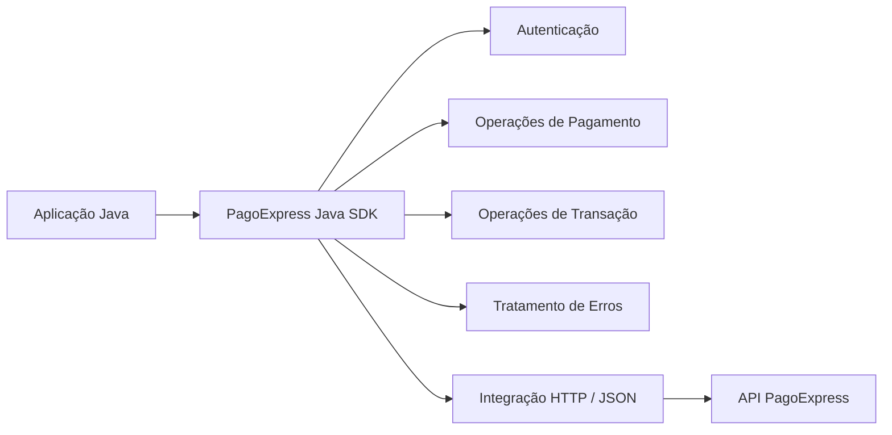

# PagoExpress Java SDK

> **Documentação pública de engenharia de um projeto de software comercial e funcional.**  
> O código-fonte proprietário não está incluído porque pertence ao cliente.

---

## Sobre este repositório

Este repositório documenta o trabalho de engenharia realizado na **SDK Java funcional desenvolvida comercialmente para a PagoExpress**.

A SDK foi construída para fornecer às aplicações Java uma camada estruturada de integração com as capacidades de pagamento da PagoExpress, evitando que cada sistema consumidor precisasse implementar manualmente autenticação, comunicação HTTP, serialização JSON, tratamento de requisições e respostas, interpretação de erros e integração com o ciclo de vida dos pagamentos.

O código-fonte original não é publicado.

Este **não é um projeto de estudo, exercício acadêmico, prova de conceito, clone ou arquitetura fictícia**. Trata-se da documentação pública de um projeto real para cliente, projetado, implementado, testado e entregue como parte de um trabalho comercial de desenvolvimento de software.

Toda a documentação deste repositório foi escrita de forma independente para apresentação profissional e passou por sanitização para evitar exposição de propriedade intelectual do cliente, credenciais, contratos privados de API, dados de produção, infraestrutura interna ou código proprietário.

---

## Classificação do projeto

| Item | Informação |
|---|---|
| Tipo | Projeto comercial de software |
| Entregável | SDK Java |
| Domínio | Integração de pagamentos / fintech |
| Cliente | PagoExpress |
| Linguagem principal | Java 17 |
| Build | Maven |
| Integração | REST / JSON |
| Responsabilidade central | Abstrair capacidades da API PagoExpress para aplicações Java |
| Código-fonte | Proprietário — não divulgado |
| Objetivo deste repositório | Documentação pública de engenharia |
| Status | Entregue |
| Relação com os plugins de e-commerce | Entregável separado |

---

## Problema

A integração direta com uma API de pagamentos espalha diversas responsabilidades pelas aplicações consumidoras:

- autenticação;
- gerenciamento de credenciais;
- construção de requisições HTTP;
- serialização e desserialização;
- modelos de requisição e resposta;
- operações específicas de pagamento;
- interpretação de estados de transação;
- erros da API;
- falhas de rede;
- notificações assíncronas;
- idempotência;
- proteção de informações sensíveis em logs;
- configuração de ambientes;
- compatibilidade com mudanças no serviço remoto.

Repetir essas responsabilidades em todos os sistemas Java que necessitassem da PagoExpress aumentaria duplicação, acoplamento e custo de manutenção.

A SDK foi criada para centralizar esses pontos atrás de abstrações Java.

---

## Solução entregue

Foi entregue uma camada reutilizável de integração Java responsável por encapsular a comunicação com a PagoExpress e disponibilizar operações de pagamento através de estruturas orientadas ao ecossistema Java.

---

## Principais capacidades

O projeto original contemplava capacidades relacionadas a:

- autenticação;
- ciclo de vida de token;
- PIX;
- boleto;
- operações de cartão existentes na entrega original;
- consulta de transações;
- captura;
- cancelamento;
- reversão/estorno;
- tratamento de status;
- integração relacionada a webhooks;
- serialização de requisições e respostas;
- normalização de erros;
- preocupações de idempotência;
- logs seguros e mascaramento de informações sensíveis;
- validação em sandbox.

> A evolução posterior de **Cartão V2** dos plugins de e-commerce é uma entrega separada e não é apresentada como parte do contrato original da SDK.

---

## Minha atuação

Minha participação de engenharia envolveu:

- estruturação da SDK como entregável independente;
- mapeamento das capacidades remotas para abstrações Java;
- modelagem de requisições e respostas;
- implementação da comunicação REST/JSON;
- implementação da autenticação;
- gerenciamento das operações autenticadas;
- organização das responsabilidades por domínio de pagamento;
- tratamento de falhas de API e conectividade;
- transformação das respostas externas em estruturas Java;
- consideração dos fluxos síncronos e assíncronos;
- tratamento seguro de logs;
- validação contra ambiente sandbox;
- empacotamento com Maven;
- preparação da biblioteca para consumo independente dos plugins de e-commerce.

---

## Stack

| Área | Tecnologia / abordagem |
|---|---|
| Linguagem | Java 17 |
| Ecossistema | Spring Boot |
| Build e dependências | Maven |
| Comunicação | REST sobre HTTP |
| Formato | JSON |
| HTTP | RestTemplate |
| JSON | Jackson / ObjectMapper |
| Autenticação | Basic Auth no fluxo de autenticação + token nas operações autenticadas |
| Modelagem | DTOs e modelos Java tipados |
| Validação | Testes de integração com sandbox |
| Automação no ecossistema de entrega | GitHub Actions / Docker |

---

## Por que o código não está aqui?

O código-fonte foi desenvolvido em um projeto comercial e pertence ao cliente.

Publicá-lo em um portfólio não seria necessário para demonstrar a engenharia e poderia expor propriedade intelectual, contratos privados de API e detalhes internos.

Por isso, este repositório apresenta de forma sanitizada:

- arquitetura;
- escopo;
- responsabilidades;
- capacidades;
- decisões de engenharia;
- estratégia de testes;
- segurança;
- problemas resolvidos;
- trade-offs;
- resultados;
- exemplos sintéticos.

Consulte [PUBLIC_DISCLOSURE.md](PUBLIC_DISCLOSURE.md).

---

## Separação entre SDK e plugins

A SDK Java é um entregável próprio.

Ela não deve ser confundida com os projetos posteriores de:

- Magento 2;
- WooCommerce;
- PrestaShop;
- Shopify.

Embora pertençam ao mesmo ecossistema de integração PagoExpress, são softwares diferentes e devem ser avaliados separadamente.

---

## Autor da documentação

**Abinadabe Oliveira**  
Desenvolvedor de Software — Java, Spring, Angular, Python, APIs, integrações e cloud.
