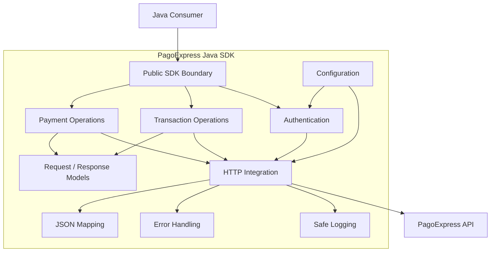

# Architecture

## Architectural objective

Provide a clear boundary between Java business applications and PagoExpress remote integration details.

## High-level structure



## Responsibility boundaries

### Public SDK boundary

Represents the operations consumed by Java applications.

Its goal is to expose payment semantics rather than raw infrastructure details.

### Configuration

Holds environment and integration configuration required by lower-level concerns.

Configuration should remain outside business payloads.

### Authentication

Coordinates the authentication process required by protected operations.

Authentication is centralized so consuming applications do not independently recreate it.

### Payment operations

Groups behavior associated with payment creation and payment-method-specific interactions.

### Transaction operations

Represents post-creation operations such as queries and eligible lifecycle actions.

### Request and response models

Typed Java structures isolate remote JSON representation from arbitrary consumer code.

### HTTP integration

Centralizes remote communication.

The original delivery used REST communication and RestTemplate.

### JSON mapping

Jackson/ObjectMapper is responsible for translating between JSON and Java structures.

### Error handling

Interprets remote and local integration failures and turns them into SDK-level failure semantics.

### Safe logging

Produces diagnostics while preventing authentication and payment-sensitive values from being unnecessarily exposed.

## Dependency direction

A consumer should depend on the SDK boundary.

It should not depend directly on:

- internal transport details;
- JSON libraries;
- authentication endpoint construction;
- remote error payload parsing;
- client-specific API internals.

The architecture therefore aims for this dependency flow:

```text
Consumer
   ↓
SDK capability
   ↓
Integration infrastructure
   ↓
Remote API
```

instead of:

```text
Consumer
 ├─ HTTP client
 ├─ authentication code
 ├─ JSON parser
 ├─ endpoint construction
 ├─ error parser
 └─ remote API
```

## Why this matters

The value of the SDK is not the existence of an HTTP call.

Its value is the consolidation of a remote payment contract behind a reusable Java integration boundary.
