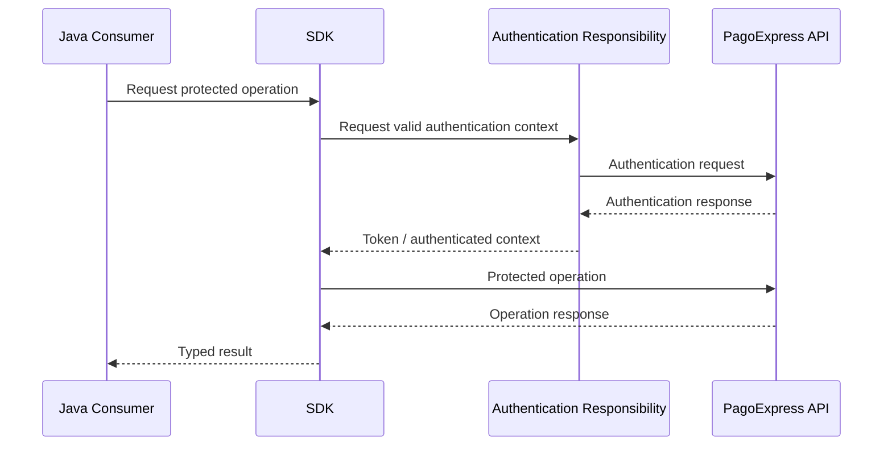

# Authentication

## Objective

Centralize authentication so consuming applications can invoke payment operations without rebuilding authentication logic for every call.

## Conceptual flow

## Technologies

The documented integration stack includes:

- Basic Auth as part of the authentication flow;
- token-based authenticated operations;
- RestTemplate for REST communication;
- Jackson/ObjectMapper for JSON processing.

## Token lifecycle

Authentication context should not be treated as ordinary business input.

The integration responsibility includes managing the usable token lifecycle rather than requiring consumers to manually attach credentials to every operation.

No exact token duration is published here because details from later PagoExpress components must not be incorrectly attributed to the original SDK.

## Security rules

Authentication implementation must prevent:

- credentials in source control;
- tokens in public logs;
- authorization headers in exception output;
- credentials inside domain objects;
- production secrets in tests.

## Failure scenarios

Authentication can fail because of:

- invalid credentials;
- remote unavailability;
- rejected authorization;
- network failure;
- malformed remote response;
- expired or unusable authentication context.

Those failures must be distinguishable from a valid payment business rejection.
