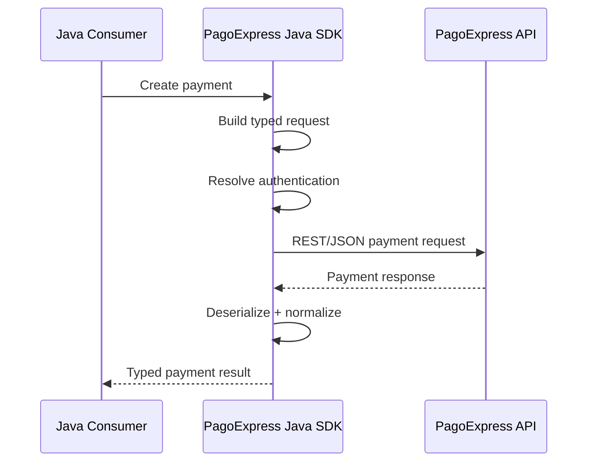
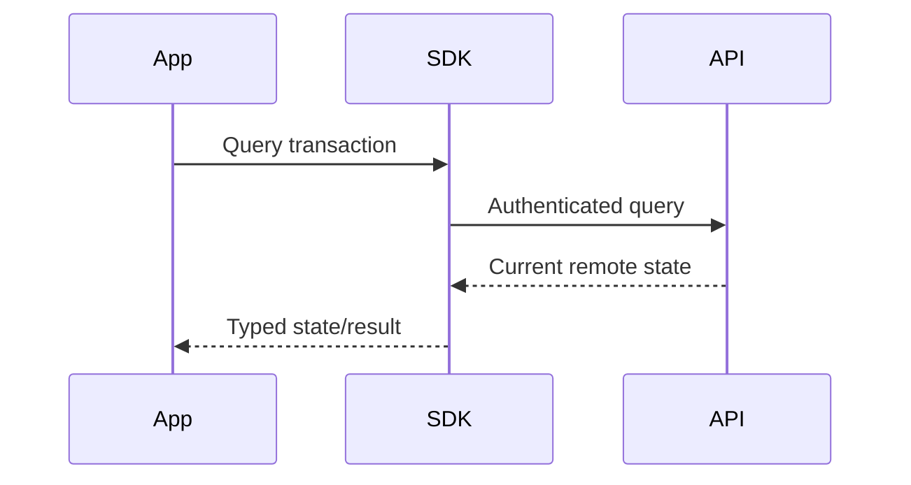
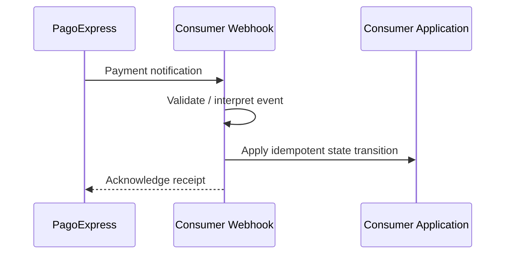

# Payment Flows

## Why payment flows require explicit modeling

Payment operations are not equivalent to generic CRUD operations.

A payment may:

- be requested;
- remain pending;
- complete later;
- fail;
- be cancelled while eligible;
- be reversed after processing;
- receive an asynchronous status update.

## Creation flow

## Pending state

A successful request does not necessarily mean the payment is financially completed.

The consuming system must preserve the distinction between:

- request accepted;
- transaction pending;
- transaction processed;
- transaction rejected;
- transaction cancelled;
- transaction reversed.

## Query flow

## Cancellation versus reversal

These are different lifecycle concepts.

### Cancellation

Used when a transaction is still in a state that permits cancellation.

### Reversal

Used when the financial lifecycle requires a compensating operation after processing.

Treating both as the same operation would hide meaningful domain rules.

## Asynchronous update flow

The inbound webhook endpoint belongs to the consumer runtime, while the SDK documentation records the asynchronous payment concern as part of the overall integration model.
