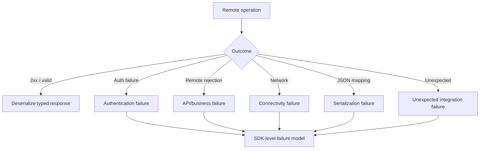

# Error Handling

## Objective

A production integration library must distinguish different failure categories instead of treating every failure as a generic exception.

## Failure categories

### Authentication failure

The remote system rejects or cannot establish the integration identity.

### Business/API rejection

The remote API understands the request but rejects it according to its contract or business rules.

### HTTP failure

The remote operation returns an unsuccessful HTTP result.

### Connectivity failure

The remote service cannot be reached or communication fails.

### Serialization failure

The SDK cannot serialize a request or interpret a returned representation.

### Unexpected response

The remote response does not match the structure expected by the integration.

## Conceptual normalization

## Error information

Useful diagnostics may include:

- operation category;
- HTTP status where safe;
- remote error classification where safe;
- correlation/request identifier where safe;
- sanitized message;
- underlying technical cause.

Diagnostics must not include secrets.

## Why normalization matters

Without an SDK-level failure model, every consuming application would need to understand:

- HTTP client behavior;
- JSON parsing exceptions;
- authentication internals;
- remote error schemas.

Centralization improves consistency and maintainability.
